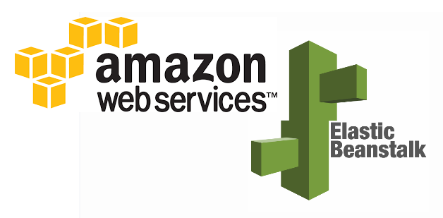
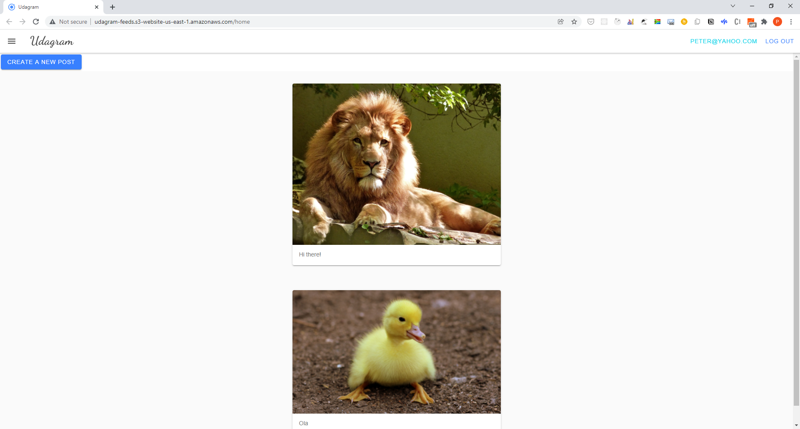
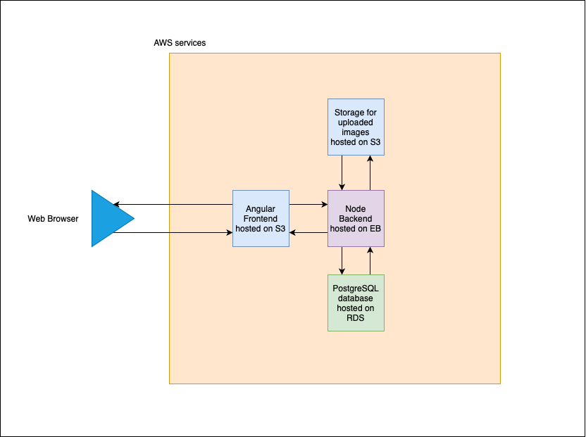
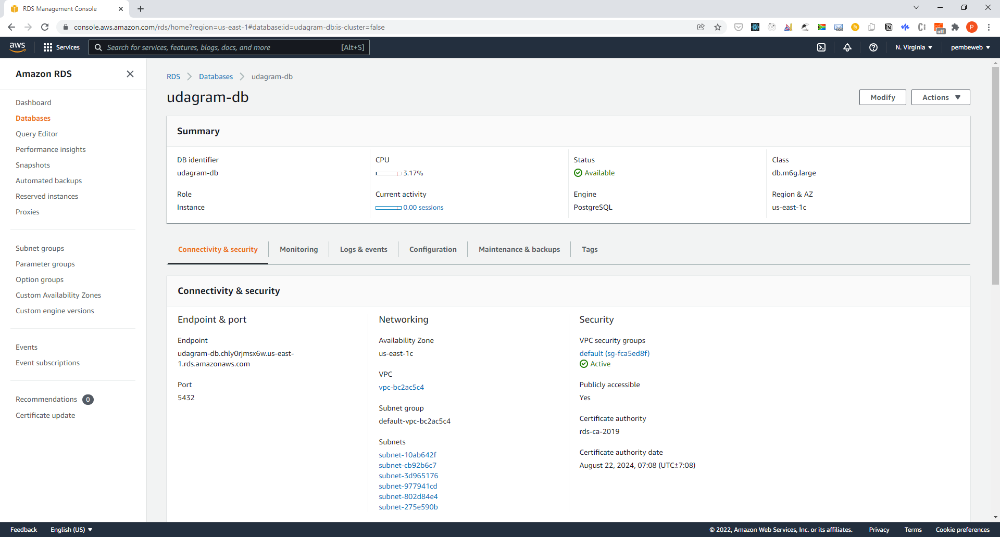
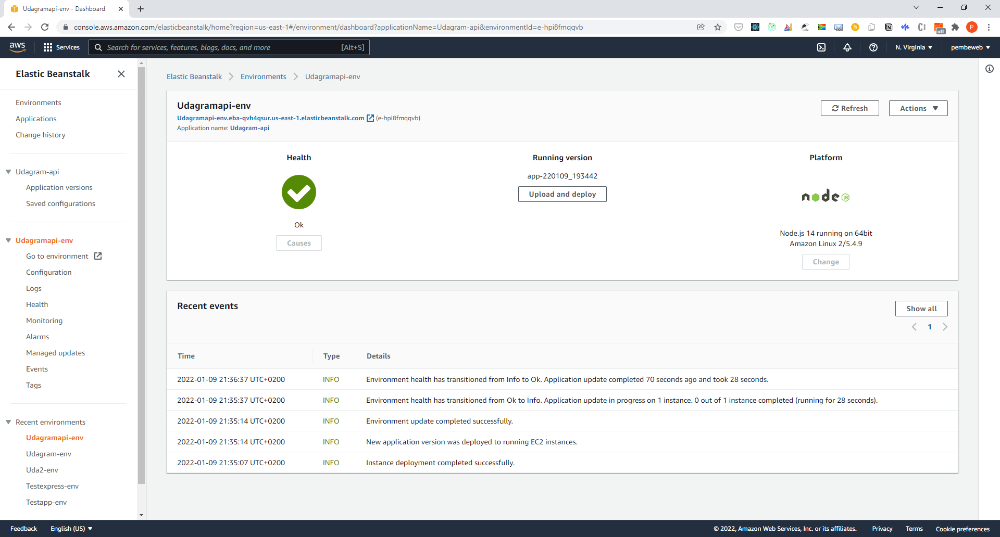
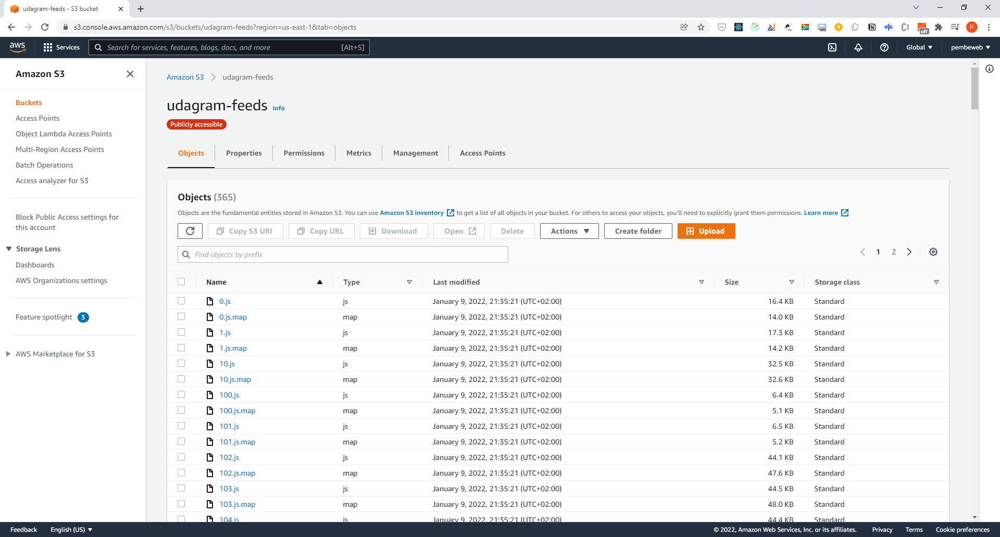
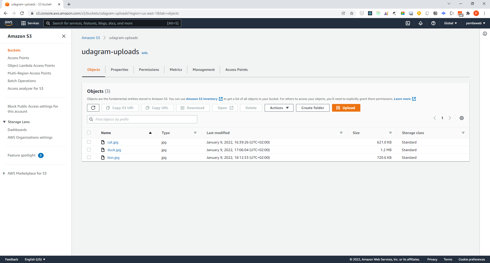
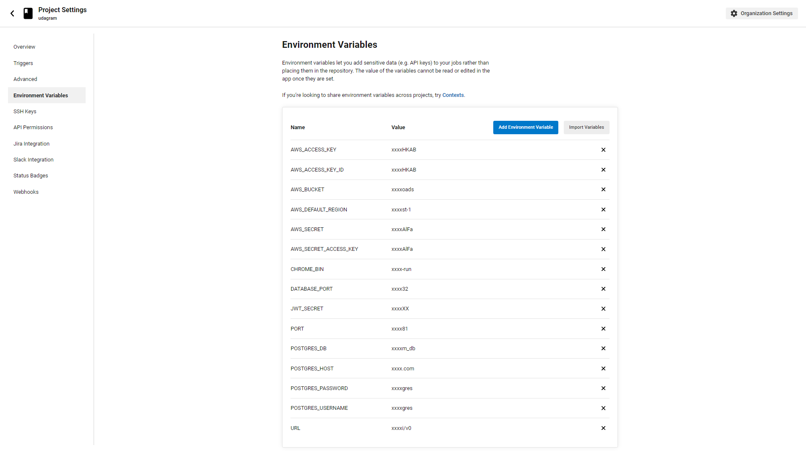
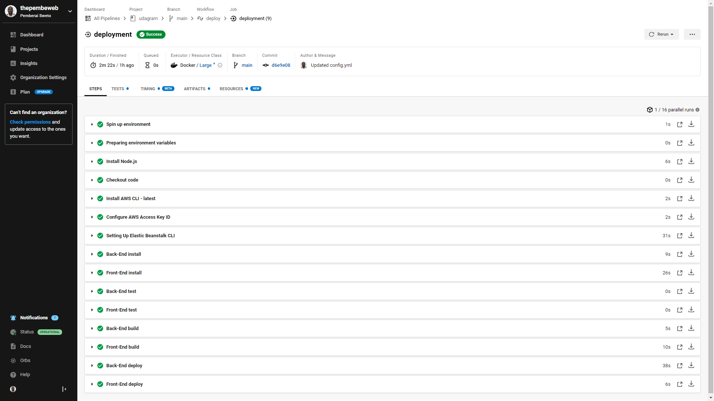

# Hosting a FullStack Application: Udagram

> This project (Udagram) demonstrates how to take a newly developed full stack application and deploy it to a cloud service provider so that it is available to customers. This application contains the main components of a 3-tier full stack application (UI, API, and Database).





Udagram showcases 3-tier full stack application (UI, API, and Database) powered by Typescript, Node.js, Express, Postgres, Angular, AWS and CircleCI; with the goal to deploy it to a cloud service provider so that it is available to customers. The app allows users to register, login, upload and view posts with images. 


## Udagram App



Visit the website [http://udagram-feeds.s3-website-us-east-1.amazonaws.com](http://udagram-feeds.s3-website-us-east-1.amazonaws.com)


## Project Infrastructure Diagram




## Getting Started

### Dependencies

```
- Node v14.15.1 (LTS) or more recent. While older versions can work it is advisable to keep node to latest LTS version

- npm 6.14.8 (LTS) or more recent, Yarn can work but was not tested for this project

- AWS CLI v2, v1 can work but was not tested for this project

- A RDS database running Postgres.

- A S3 bucket for hosting uploaded pictures.

```

### Cloning the project

Clone the source locally:

```sh
$ git clone https://github.com/thepembeweb/udagram.git
$ cd udagram
```

### Installation

Provision the necessary AWS services needed for running the application:

1. In AWS, provision a publicly available RDS database running Postgres.
2. In AWS, provision a s3 bucket for hosting the uploaded files.
3. Export the ENV variables needed or use a package like [dotnev](https://www.npmjs.com/package/dotenv)/.
4. From the root of the repo, navigate udagram-api folder `cd udagram/udagram-api` to install the node_modules `npm install`. After installation is done start the api in dev mode with `npm run dev`.
5. Without closing the terminal in step 1, navigate to the udagram-frontend `cd udagram/udagram-frontend` to intall the node_modules `npm install`. After installation is done start the api in dev mode with `npm run start`.

### Set up Environment variables

1. navigate udagram-api folder `cd udagram/udagram-api`
2. Create a `.env` file in the udagram-api directory
3. Setup the following env variables
```
POSTGRES_HOST=<postgress db instance hostname>
DATABASE_PORT=<postgress db instance hostname port>
POSTGRES_DB=<postgress db name>
POSTGRES_USERNAME=<postgress db username>
POSTGRES_PASSWORD=<postgress db password>
AWS_REGION=<aws region>
AWS_BUCKET=<aws bucket>
JWT_SECRET=<secret string for encrypting app passwords>
AWS_ACCESS_KEY=<aws access key>
AWS_SECRET=<aws secret key>
URL=<api url>
```
 
## Testing

This project contains two different test suite: unit tests and End-To-End tests(e2e). Follow these steps to run the tests.

1. `cd starter/udagram-frontend`
2. `npm run test`
3. `npm run e2e`

There are no Unit test on the back-end

### Unit Tests:

Unit tests are using the Jasmine Framework.

### End to End Tests:

The e2e tests are using Protractor and Jasmine.

  
## Configuration Screenshots

### PostgreSQL RDS database



### Backend API Elastic Beanstalk Environment



### FrontEnd S3 Bucket



### Uploads S3 Bucket



### CircleCI Pipeline Environment Variables



### CircleCI Pipeline



  
## Built With

* [Angular](https://angular.io/) - Single Page Application Framework
* [Node](https://nodejs.org) - Javascript Runtime
* [Express](https://expressjs.com/) - Javascript API Framework
* [Postgres](https://www.postgresql.org/) - The Database used


## Authors

* **[Pemberai Sweto](https://github.com/thepembeweb)** - *Initial work* - [Hosting a FullStack Application: Udagram](https://github.com/thepembeweb/udagram)

  
## License

[](http://badges.mit-license.org)

- This project is licensed under the MIT License - see the [LICENSE.md](LICENSE.md) file for details
- Copyright 2022 © [Pemberai Sweto](https://github.com/thepembeweb).
