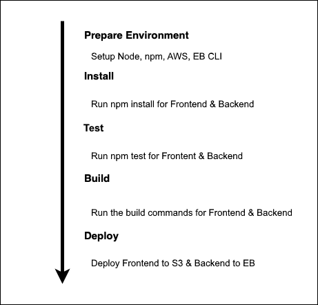

# Pipeline Process

The pipeline is setup and connected with this GitHub repository in CircleCI.

## Order of commands

1. The pipeline uses orbs to install Node, the AWS cli and the EB cli.
2. It checks out the code from the repo
3. Front-End & Back-End install
4. Front-End & Back-End test
5. Front-End & Back-End build
6. Front-End & Back-End deploy

## Pipeline

